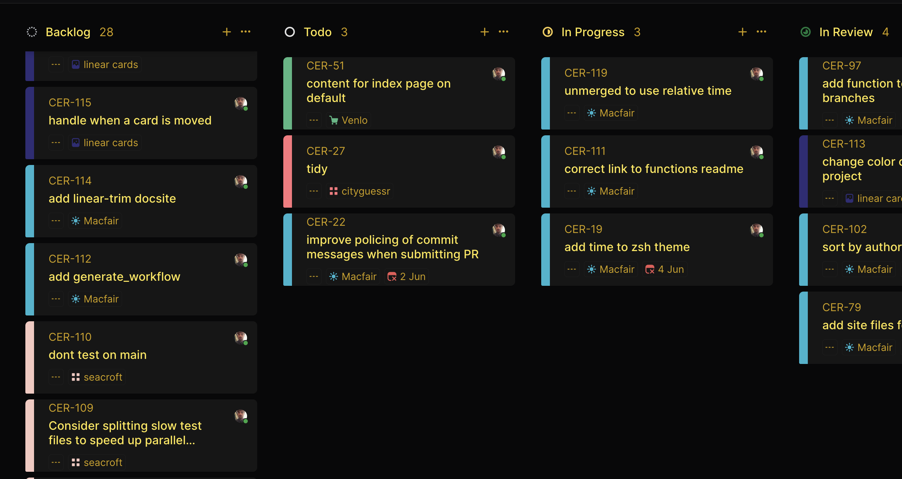

# Linear Card Highlighter

Linear Card Highlighter is a firefox browser extension that adds a trim to linear cards for better visibility across projects.


## Description

Linear Card Highlighter enhances the visibility of cards in Linear by adding a color trim to them. This is especially useful when managing multiple projects in Linear, as it provides a clear distinction between different cards.



## Features

- Adds a color trim to Linear cards based on project preferences.
- Automatically detects and trims cards upon page load.

## Installation

1. Add the extension from the [Firefox Add-ons Store](https://addons.mozilla.org/en-US/firefox/addon/linear-card-highlighter/)
2. Click "Add to Firefox"

## Usage

Once installed, the extension will automatically add a trim to Linear cards when you visit [https://linear.app](https://linear.app/).

## Development

### Local Setup

1. Clone the repository:
   ```bash
   git clone https://github.com/cerico/linear-card-highlighter.git
   ```
2. Load the extension in Firefox:
   - Open Firefox
   - Navigate to `about:debugging`
   - Click "This Firefox"
   - Click "Load Temporary Add-on"
   - Select the `manifest.json` file from the cloned repository

## Contributing

If you'd like to contribute to the development of Linear Card Highlighter, please fork the repository and submit a pull request.

## License

This project is licensed under the MIT License.

## Acknowledgments

- Thanks to the Linear website for providing the platform.
